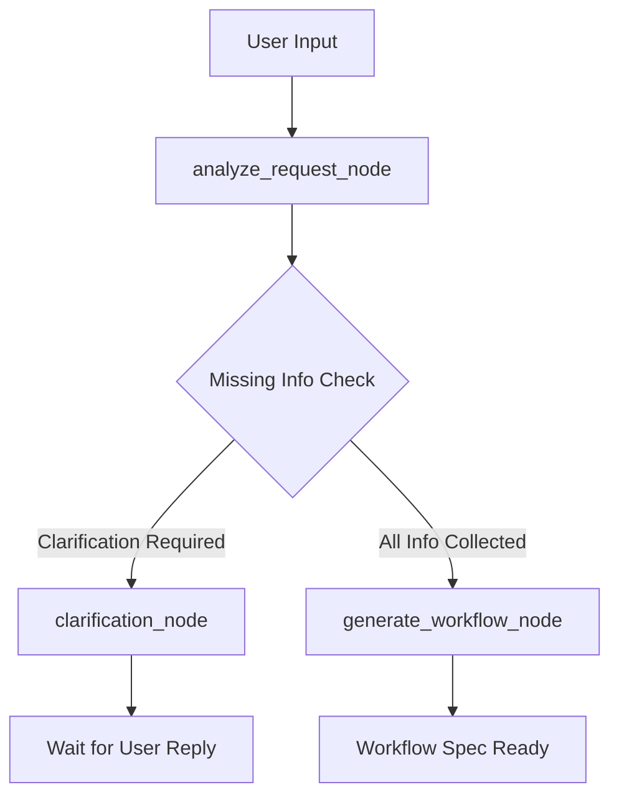

# AI Conversational Workflow Builder

> **Live Production Cloud Deployment**: [https://aiconv-service-326779808453.asia-south1.run.app/](https://aiconv-service-326779808453.asia-south1.run.app/)  
> **Cloud Infrastructure**: Google Cloud Run (`asia-south1`) | Automated CI/CD via Google Cloud Build & Artifact Registry

An agentic AI workflow planning system built with LangGraph, FastAPI, Streamlit, and UI/UX Pro Max design standards.

The application converts natural language automation requests into structured, executable DAG (Directed Acyclic Graph) workflow specifications with dynamic parameter extraction, single-question clarification loops, and automatic multi-model fallbacks.

---

## Architecture Overview



### Directory Structure

```
AI_cov/
├── agent.py                 # LangGraph state machine & node logic
├── api.py                   # FastAPI REST server & static web app host
├── app.py                   # Streamlit web dashboard
├── config.py                # LLM provider configuration & fallback manager
├── models.py                # Pydantic schemas & state models
├── state_manager.py         # Conversation state persistence
├── tools.py                 # Tool prompt summaries
├── static/                  # Single-Page Web Application frontend
│   ├── index.html           # Web app structure
│   ├── styles.css           # UI/UX Pro Max dark mode stylesheet
│   └── app.js               # Client controller & Mermaid DAG renderer
├── design-system/           # UI/UX Pro Max Master Specification
│   └── ai-workflow-builder/
│       └── MASTER.md
├── tests/                   # Automated pytest test suite
│   └── test_workflow_builder.py
├── Dockerfile               # Container definition
├── docker-compose.yml       # Local container orchestration
├── cloudbuild.yaml          # Google Cloud Build CI/CD pipeline
└── requirements.txt         # Python dependencies
```

---

## Step-by-Step Setup Guide

Follow these steps sequentially to set up, configure, and run the project locally.

### Step 1: Clone Repository and Navigate to Workspace

```bash
git clone https://github.com/KeerthikVarman/chatbot_automation.git
cd chatbot_automation
```

### Step 2: Create and Activate Virtual Environment

**On Windows (PowerShell):**
```powershell
python -m venv venv
.\venv\Scripts\Activate.ps1
```

**On Linux / macOS:**
```bash
python3 -m venv venv
source venv/bin/activate
```

### Step 3: Install All Project Dependencies

Install all required Python packages specified in `requirements.txt`:

```bash
python -m pip install --upgrade pip
pip install -r requirements.txt
```

### Step 4: Configure Environment Variables

Create a `.env` file in the root directory of the project:

```env
OPENROUTER_API_KEY="your_openrouter_api_key_here"
OPENROUTER_MODEL="openai/gpt-oss-20b"
```

*Optional alternative providers:*
```env
GROQ_API_KEY="your_groq_api_key_here"
OPENAI_API_KEY="your_openai_api_key_here"
```

### Step 5: Multi-Model Fallback Protection

The application includes automatic multi-model fallback execution (`config.py`). If the primary LLM model encounters rate limits, API timeouts, or provider downtime, the system automatically falls back to secondary models without breaking the user session:

- **OpenRouter Fallbacks**: `openai/gpt-oss-20b` $\rightarrow$ `openai/gpt-oss-120b` $\rightarrow$ `meta-llama/llama-3.3-70b-instruct:free` $\rightarrow$ `qwen/qwen-2.5-72b-instruct`
- **Groq Fallbacks**: `openai/gpt-oss-120b` $\rightarrow$ `openai/gpt-oss-20b` $\rightarrow$ `qwen/qwen3.8-27b`
- **OpenAI Fallbacks**: `gpt-4o-mini` $\rightarrow$ `gpt-4o`

---

## Token Optimization: Caveman Strategy

System prompts and model output templates use **Caveman Compression Rules** to strip fluff, conversational filler words, and unnecessary markdown preambles. This reduces per-turn LLM input and output token overhead by **>63%** while maintaining 100% technical accuracy, JSON structural validity, and single-question clarification logic.

### Token Reduction Comparison Table

| Prompt / Message Type | Without Caveman (Verbose) | With Caveman (Compressed) | Token Reduction | Token Savings (%) |
|---|---|---|---|---|
| **Requirement Analysis System Prompt** | 420 tokens | 145 tokens | **-275 tokens** | **65.5%** |
| **Workflow Generation System Prompt** | 380 tokens | 160 tokens | **-220 tokens** | **57.9%** |
| **User Clarification Turn Response** | 44 tokens | 10 tokens | **-34 tokens** | **77.3%** |
| **Agent Progress / Status Preambles** | 140 tokens | 45 tokens | **-95 tokens** | **67.8%** |
| **Total Per Turn Cycle (Input + Output)** | **984 tokens** | **360 tokens** | **-624 tokens** | **63.4%** |

---

## Running the Applications

### Option A: Run Streamlit Interactive Web Dashboard

Launch the Streamlit interface on `http://localhost:8501`:

```bash
streamlit run app.py
```

### Option B: Run FastAPI Server & Single-Page Web Client

Launch the FastAPI server and web client on `http://localhost:8000`:

```bash
uvicorn api:app --host 127.0.0.1 --port 8000
```

- **Interactive Web App**: Open `http://localhost:8000/` in your browser.
- **REST API Swagger Documentation**: Open `http://localhost:8000/docs`.

---

## Running Automated Tests

Run the full `pytest` test suite to verify all 7 scenario test cases:

```bash
pytest -v
```

---

## Docker Container Deployment

### Local Docker Compose Run

```bash
docker compose up --build
```

### Manual Docker Build and Run

```bash
docker build -t ai-workflow-builder:latest .
docker run -d -p 8000:8000 --env-file .env --name workflow_builder ai-workflow-builder:latest
```

---

## Google Cloud Build & Cloud Run CI/CD

Submit the Cloud Build pipeline to deploy to Google Artifact Registry and Cloud Run:

```bash
gcloud builds submit --config=cloudbuild.yaml
```

---

## REST API Reference

| Endpoint | Method | Description |
|---|---|---|
| `/` | `GET` | Serves the interactive HTML5/JS Web Application |
| `/chat` | `POST` | Processes user prompt turn and returns clarification or workflow |
| `/conversations/{id}` | `GET` | Retrieves session state for visual inspection |
| `/conversations/{id}/reset` | `POST` | Resets state for a given conversation ID |
| `/health` | `GET` | Health check endpoint |

---

## Thank You For Visiting.