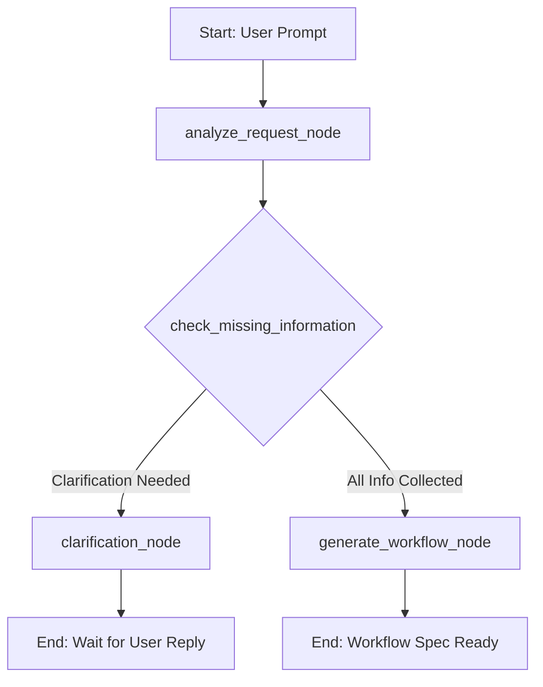

# ⚡ AI Conversational Workflow Builder

An agentic, multi-provider AI workflow architecture built with **LangGraph**, **FastAPI**, **Streamlit**, and **UI/UX Pro Max** design system standards.

Transform plain English automation goals into structured, executable DAG (Directed Acyclic Graph) workflow specifications with dynamic requirement extraction, single-question clarification loops, and multi-model fallback execution.

---

## 🌟 Key Features

- 🧠 **Dynamic Requirement Identification**: Automatically determines required parameters for triggers, actions, and filters (Gmail, Slack, GitHub, Google Sheets, webhooks) without hardcoding.
- 💬 **Single-Question Clarification Loop**: Enforces strictly one clarification question at a time when parameters are missing or ambiguous — never overwhelming the user.
- 🔄 **LangGraph Agentic State Machine**: Powered by a robust state graph (`analyze_request` $\rightarrow$ `clarification` | `generate_workflow`).
- 🛡️ **Multi-Model Provider Fallback Engine**: Seamlessly supports **OpenRouter**, **Groq**, and **OpenAI**. Automatically falls back to secondary models (`openai/gpt-oss-20b` $\rightarrow$ `openai/gpt-oss-120b` $\rightarrow$ `llama-3.3-70b`) on rate limits or API downtime.
- 🎨 **UI/UX Pro Max Interfaces**:
  - **Streamlit Web Dashboard (`app.py`)**: Glassmorphism dark slate UI, real-time readiness gauge ($0\% \rightarrow 100\%$), parameter matrix, Mermaid DAG visualizer, and 1-click `.json` workflow download.
  - **FastAPI Interactive Web Client (`static/index.html`)**: Single-page Web App with preset scenario triggers, conversational chat assistant, suggestion chips, live state drawer, and Mermaid.js DAG renderer.
- 🧪 **Comprehensive Test Suite**: Automated `pytest` suite testing all preset scenarios, dynamic state persistence, and FastAPI REST endpoints.

---

## 🏗️ Architecture & LangGraph State Machine



### Component Structure
```
AI_cov/
├── agent.py                 # LangGraph state graph & node execution logic
├── api.py                   # FastAPI REST server & static web app host
├── app.py                   # Streamlit interactive web dashboard
├── config.py                # LLM provider config & multi-model fallback engine
├── models.py                # Pydantic & LangGraph state models
├── state_manager.py         # Multi-turn conversation state persistence
├── tools.py                 # Abstract tool prompt summaries
├── static/                  # Single-Page Web Application frontend
│   ├── index.html           # HTML5 UI structure
│   ├── styles.css           # UI/UX Pro Max dark glassmorphic CSS tokens
│   └── app.js               # Interactive JS state controller & Mermaid renderer
├── design-system/           # Persisted UI/UX Pro Max Master Specification
│   └── ai-workflow-builder/
│       └── MASTER.md        # Master design tokens & style guide
└── tests/                   # Automated pytest suite
    └── test_workflow_builder.py
```

---

## 🛠️ Technology Stack

- **Core Logic**: Python 3.14+, LangGraph, LangChain, Pydantic v2
- **LLM Providers**: OpenRouter, Groq API, OpenAI API
- **Web Applications**: Streamlit, FastAPI, Uvicorn, HTML5/Vanilla CSS3/JavaScript
- **Visualization**: Mermaid.js DAG renderer
- **Testing**: pytest, FastAPI TestClient

---

## 🚀 Getting Started

### 1. Prerequisites
- Python 3.10+ installed on your system.

### 2. Installation & Virtual Environment

```bash
# Clone or open workspace directory
cd AI_cov

# Create virtual environment
python -m venv venv

# Activate virtual environment
# Windows PowerShell:
.\venv\Scripts\Activate.ps1
# Linux/macOS:
source venv/bin/activate

# Install requirements (if needed)
pip install -r requirements.txt
```

### 3. Environment Configuration (`.env`)

Create or update `.env` in the project root:

```env
# OpenRouter (Recommended)
OPENROUTER_API_KEY="your-openrouter-api-key"
OPENROUTER_MODEL="openai/gpt-oss-20b"

```

---

## 💻 Running the Applicatio
### Option A: Streamlit Interactive Web Dashboard

Launch the Streamlit interface on `http://localhost:8501`:

```bash
streamlit run app.py
```

### Option B: FastAPI Server & Single-Page Web Client

Launch the FastAPI server and interactive web client on `http://localhost:8000`:

```bash
uvicorn api:app --reload --port 8000
```
- **Web App**: Open `http://localhost:8000/` in your browser.
- **Swagger API Docs**: Open `http://localhost:8000/docs`.

---

## 🔌 API Reference

| Endpoint | Method | Description |
|---|---|---|
| `/` | `GET` | Serves the interactive HTML5/JS Web Application |
| `/chat` | `POST` | Processes user prompt turn, updates state, returns clarification or workflow |
| `/conversations/{id}` | `GET` | Retrieves current session state for dynamic inspection |
| `/conversations/{id}/reset` | `POST` | Resets state for a given conversation ID |
| `/health` | `GET` | API health check endpoint |

### Sample Chat Request Body (`POST /chat`)

```json
{
  "conversation_id": "session_demo_01",
  "message": "When a new email with subject 'Urgent' arrives in my Gmail inbox for account user@example.com, send a Slack notification to #alerts channel in Acme workspace."
}
```

---

## 🧪 Running Tests

Execute the comprehensive automated test suite:

```bash
pytest
```
Or directly via virtual environment:
```bash
.\venv\Scripts\pytest.exe
```

---

## 🎨 UI/UX Pro Max Design System

This project strictly adheres to the **UI/UX Pro Max** design system:
- **Design Master File**: [`design-system/ai-workflow-builder/MASTER.md`](file:///e:/AI_cov/design-system/ai-workflow-builder/MASTER.md)
- **Palette**: Deep Slate Dark Mode (`#0B0F17` background, `#141B2D` card glass surface)
- **Accents**: Violet (`#7C3AED`) $\rightarrow$ Indigo (`#6366F1`) $\rightarrow$ Cyan (`#06B6D4`) AI Glow
- **Typography**: Space Grotesk (Headings), Inter (Body), Fira Code (Code/Params)

---

## 📄 License

MIT License. Built with ❤️ for AI Automation.
